# Battleships Game with Game Server

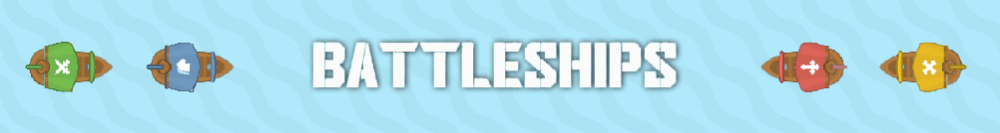

- [Overview](#overview)
    - [About game](#about-game)
    - [About game server](#about-game-server)
    - [Requirements](#requirements)
    - [Maintainers](#maintainers)
    - [Screenshots](#screenshots-of-the-game)
- [How To](#how-to)
    - [Run game](#run-game)
    - [Change lobby player quantity](#change-lobby-player-quantity)
    - [Build Client or Server as a JAR file after any changes](#build-client-or-server-as-a-jar-file-after-any-changes)
    - [Upload game server to the remote server and run it](#upload-game-server-to-the-remote-server-and-run-it)
    - [Make a game server as service](#make-a-game-server-as-service)

## Overview
### About game
- For move the ship, use keys `[W] [A] [S] [D]`
- For shooting, use `Mouse Left Click`
- In `Settings` is possible to change Music and Sound volume or turn them off.
- In `New Game` is need to write nickname and choose skin of ship. There are required.
- For choosing the skins of the ship is available 4 different skins.
- Game available only in multiplayer mode.
- Game will not start if in lobby is not required amount of players. `By default is 3 players.`

### About game server
The game server runs on a remote TalTech server as a service.

### Requirements
#### For only enjoying the game, then requirement is:  
    Java 11 or higher. 
#### For change something in code and after that build the project, then requirements are:
    Java 11 or higher.
    Gradle 6.7.1

### Maintainers

Markus Koert <b><i><a href="https://gitlab.cs.ttu.ee/makoer">@makoer</a></i></b>  
Anti Natka   <b><i><a href="https://gitlab.cs.ttu.ee/anti.natka">@anti.natka</a></i></b>  
Aleksandr Trofimov <b><i><a href="https://gitlab.cs.ttu.ee/altrof">@altrof</a></i></b>  

### Screenshots of the game

  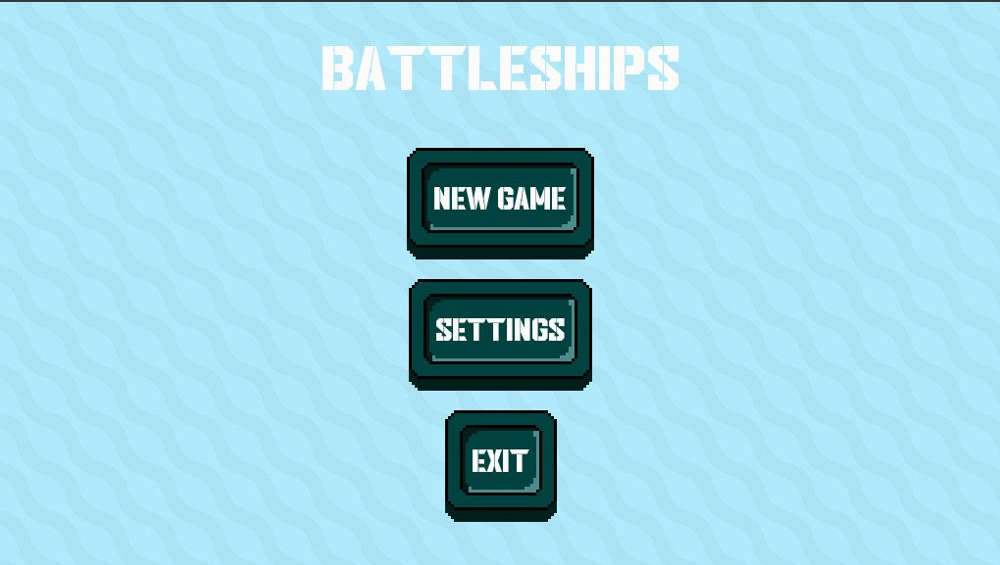
  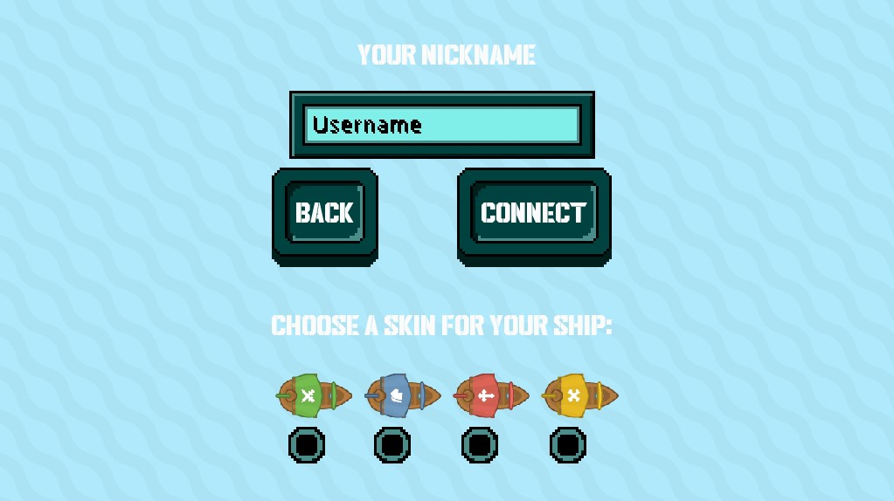
  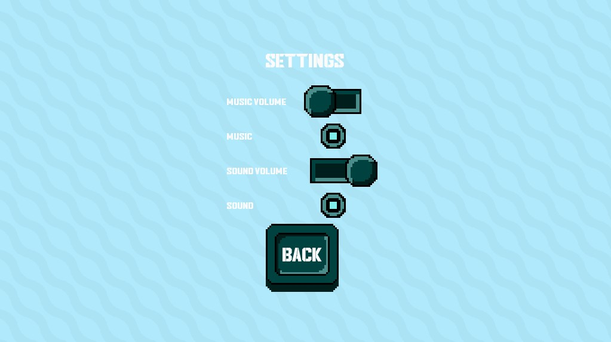
  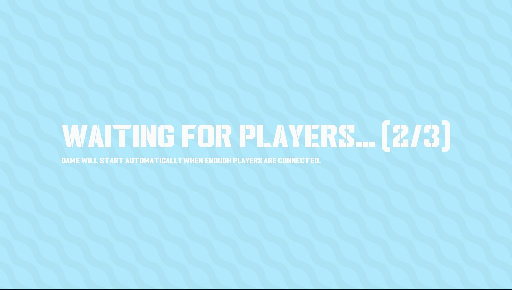
  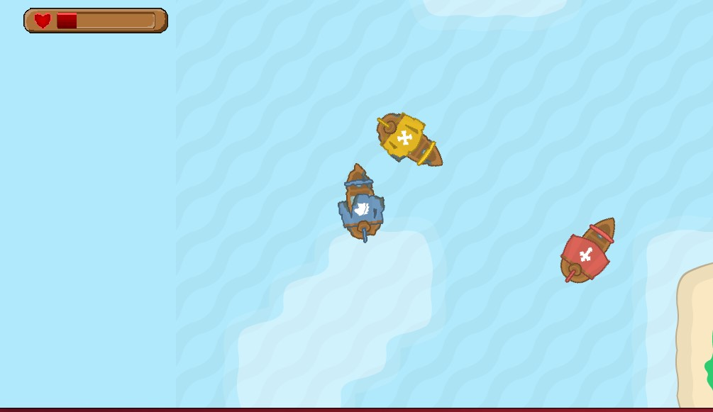
  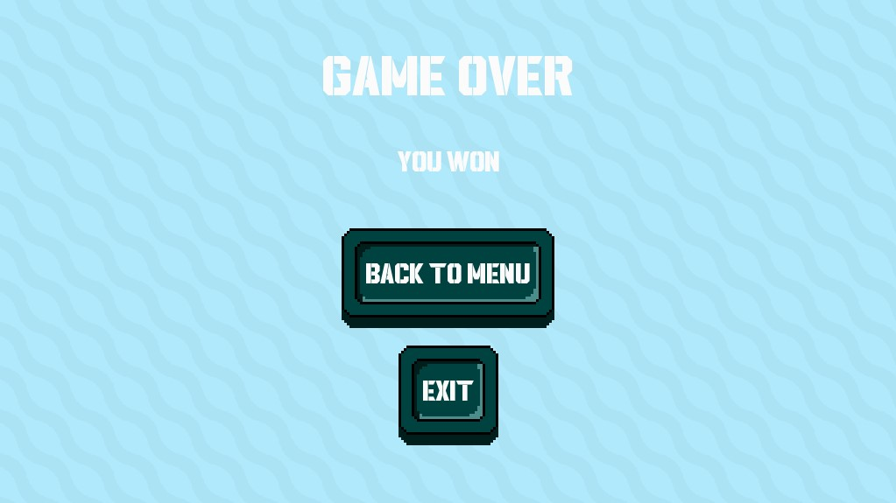
  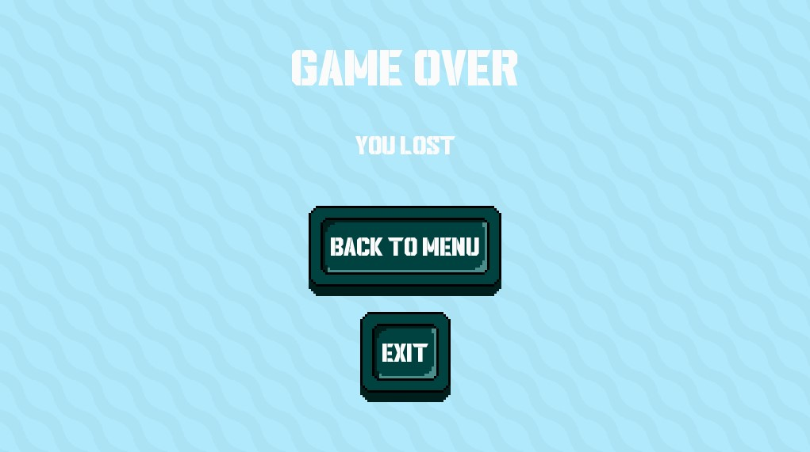

## How To
### Run game
  #### Go to the /out folder
      java -jar Client.jar
### Change lobby player quantity
    Client > core > src > com > battleships > game > views > LobbyScreen.java
    
    private final int lobbyPlayerCount = 3;  // 32 line
### Build Client or Server as a JAR file after any changes
  #### After any changes in code, its have to rebuild.
    File > Project Structure > Artifacts
  Here is the button [+] on the upside. 
  1. There choose a "JAR" and after that - "From modules with dependencies".  
  2. In module window:  
  &nbsp;&nbsp;&nbsp;&nbsp; - Module: Server.core.main  
  &nbsp;&nbsp;&nbsp;&nbsp; - Main Class: ServerConnection.ServerConnection  
  3. In Output directory is possible to change a path of build JAR file. Apple and OK
  4. Last step is choose on navigation panel Build and after that Build Artifacts. 
     &nbsp;&nbsp; Server.core.main:jar > Build

  
  
  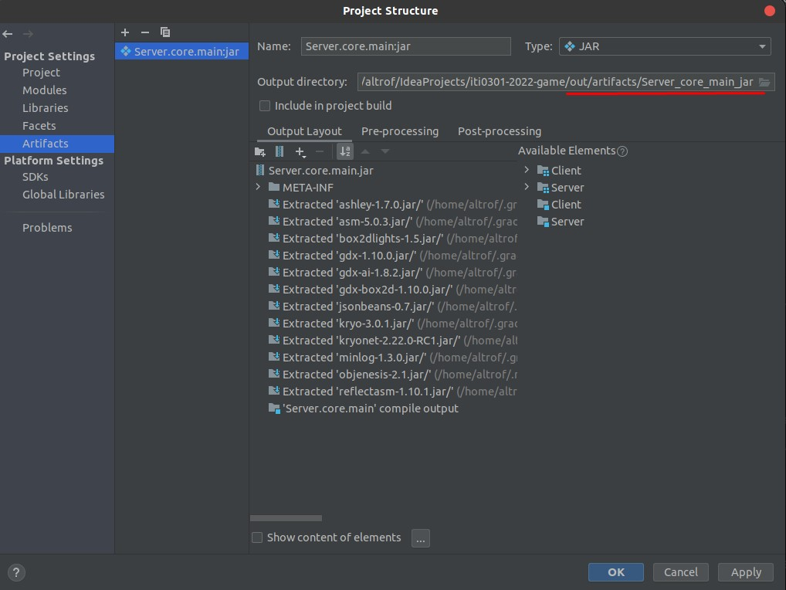
  

    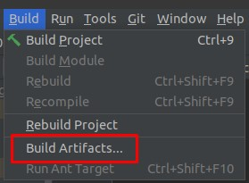
    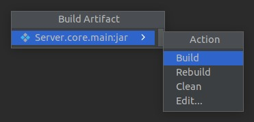
  

### Upload game server to the remote server and run it
  First after connecting to the server, check on the remote server is there a Java available. 

    ssh user@ip_server
    java --version  // If there is some error, then pls download a java 
    git clone <remote_repo_url>
    cd <repo_name>/out
    java -jar Server.main.core.jar

### Make a game server as service
  Why is it necessary to do as a service?  
  &nbsp;&nbsp;&nbsp; - Main idea is, server is running on the background. When user disconnect from the remote server, then game server will be work.  
  (+) One of alternative to a service is to use <a href="https://docs.docker.com/get-started/overview/"><b>Docker</b></a> (Dockerfile and Docker Compose). 
   #### Create a file service:
      sudo vim /etc/systemd/system/gameserver
      vim is screen-based text editor, you can choose another.
      /gameserver - gameserver is service name, you can write something own
  
  #### In this file write:
      [Unit]
      Description=My Java Game Server as Service

      [Service]
      User=ubuntu  <-- your user with sudo priveleges
      WorkingDirectory=/home/ubuntu/... <-- path of project game from home dir
      ExecStart=/usr/bin/java -jar Server.core.main.jar
  
  #### Systemctl commands:
      sudo systemctl daemon-reload
      sudo systemctl enable gameserver
      sudo systemctl start gameserver
      sudo systemctl restart gameserver
      sudo systemctl status gameserver
    
### Screenshot of working gameserver as a service

